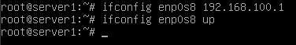

# KEST2LG05DU - Final Project H-2019

## Top notes

* For this installation I will be using "**Debian 10.1 32bit**" since it's the latest version from the Debian foundation which I am the most comfortable with.
* The virtual machine platform I will be using is "**VMware Workstation**"

## VMware Configuration

To ensure that the virtual machines are accurately setup for local testing, I've modified to "Virtual Network Editor" with the following, **notice how I've disabled DHCP on Host-Only**

## Hardware specifications

**Server1 and Client1**

- 1 CPU
- 1024MB of memory
- NAT network interface as an external interface (**Server only**)
- Host-only network interface as a private interface
- VDI virtual disk with max 8GB of space

## Server1 configuration

I chose the external interface as the Primary network interface so that the server would have internet access by default.

The server hostname is "**server1**"

The root password is "**1483369ABQ**"

I've created the main user with the following configuration:

* Full name: **Administrator**
* User name: **administrator**
* Password: **C10H15N**

**The rest of the installation have been set to default and due to this being an example, I've decided not to install a desktop environment**

After the installation finished I update the apt repositories and make sure the latest stable versions of software has been installed.

---

Now that the installation has been successfully completed, I can go into setting up the system to act as a server as described in the assignment.

I begin with changing the hostname of the server to "**server1**" and the domain name to "**tristan.local**" (as described in the assignment, personally I wouldn't put my name into it) so that the FQDN (Fully Qualified Domain Name) of the server will be "**server1.tristan.local**"

---

For the DHCP server I install dnsmasq via aptitude with the command `apt install dnsmasq`

With `ip a` I am able to take a look at the network interfaces

With this information I am able to configure the DHCP server to use the private interface (enp0s8) we made by modifying the `/etc/dnsmasq.conf` file

Now that the configurations are set, I am able to assign a static IP address for the server itself with `ifconfig enp0s8 192.168.100.1` and enable the interface with `ifconfig enp0s8 up`

**Installing dnsmasq without additional configurations has already created a DNS (domain name server).**

---

## Client1 configuration

The installation process does not require any special modification thus I have kept the default options apart from setting the hostname to "**client1**" and the domain to "**tristan.local**" so that the FQDN is "**client1.tristan.local**"

* The root password is "**1483369ABQ**"

The main user has the following configuration:

+ Name: "**Administrator**"
+ User: "**administrator**"
+ Pass: "**C10H15N**"

**Using the same password for both the client and the server is not recommended, this is only for demonstration purposes**

